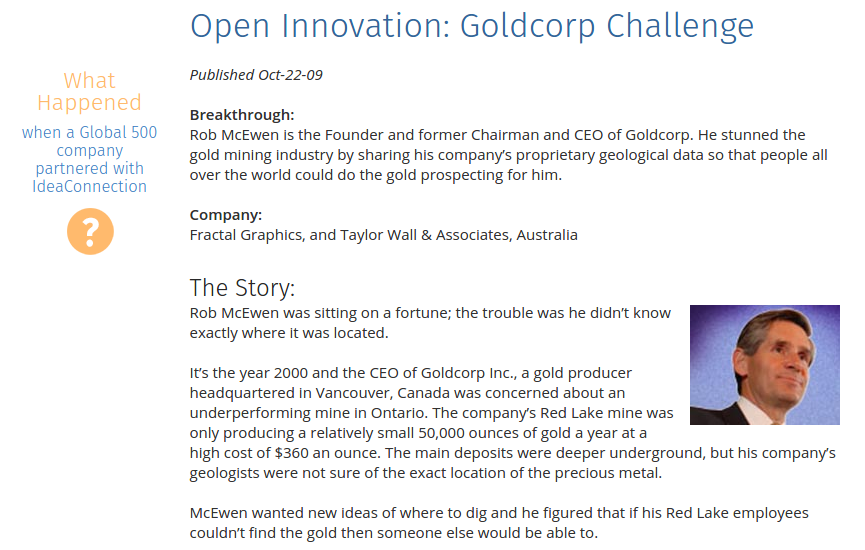

```{r setup, include=FALSE}
options(htmltools.dir.version = FALSE)
knitr::opts_chunk$set(cache = TRUE)
```

class: center, middle


???
En 1973, lorsque Pinochet renverse Allende et prend le pouvoir au Chili, les militaires découvrent une étrange pièce, destinée à assurer le contrôle cybernétique du gouvernement socialiste sur le pays. Ce projet, nommé Cybersyn, avait été développé avec le cybernéticien britannique Stafford Beer.

---
class: center, middle

.reduite[]

???
L'app iPad développée pour David Cameron, "No. 10 Dashboard", s'inscrit dans le même imaginaire cybernétique du contrôle de tout en temps réel. Comme le souligne Philippe Gargov dans sa récente étude, l'imaginaire de la data a fortement partie liée à l'imaginaire cybernétique.


---
class: center, middle
background-image: url(./img/rosie.jpg)

???
Pour autant, cette approche d'un big data algorithmisé ne rend pas nécessairement bien compte des enjeux de l'open data. Ceux-ci sont moins techniques que politiques, sociaux, humains, communicationnels.

---
class: inverse, center, middle

# Communication corporate 
# et
# open data

</BR>
</BR>

### Joël Gombin et Samuel Goëta
### [datactivi.st/angie](www.datactivi.st/angie)


---
class: center, middle

[](https://creativecommons.org/licenses/by-sa/3.0/fr/)

---
class: middle, center

# Open data : de quoi parle-t-on ?

---
class: middle, center
# transparence

---
class: middle, center
# accountability

???
Redevabilité

---
class: middle, center
# parties prenantes

---
class: middle, center

## Ces exigences concernent également, de plus en plus, les entreprises privées

---
class: middle, center

## Tout le monde a des parties prenantes

---
class: middle, center

# Brève histoire de l'open data

---
class: middle
# 1789

.middle[
> "La Société a le droit de demander compte à tout Agent public de son administration."
>
> (art. 15 Déclaration des droits de l'homme et du citoyen)
]

---
class: middle
# Années 1960

> "Open governement" (USA)

---
class: middle
# 1966

> Freedom Of Information Act (USA)

---
class: middle
# 1978

> Loi CADA (France)

---
class: middle
# 2007

> Conférence de Sébastopol (USA)


???

Tim O'Reilly
Lawrence Lessig
Aaron Swartz

---
class: middle
# 2009

> Mémorandum sur l'open government signé par Obama

---
class: middle
# 2011

> Création de data.gouv.fr et d'Etalab

---
class: middle
# 2013

> Charte du G8

---
class: middle
# 2016

> Loi pour une République numérique

???

Open data par défaut


---
class: inverse, center, middle

# L'open data, pour quoi faire ?

---
class: middle, center

## Décloisonner

---
class: middle, center

## Innover

---
class: middle, center


???


---
class: middle, center


???


---
class: middle, center


---
class: middle, center


---
class: middle, center

## Construire une communauté

---
class: middle, center


---
class: middle, center


---
class: middle, center

## RP / Public affairs

---
class: middle, center


---
class: middle, center


---
class: middle, center


???

By Transdev

---
class: middle, center


???

Corporate data philanthropy

---
class: middle, center

## Bâtir la confiance

---
class: middle, center


---
class: middle, center


???

By RTE et Enedis


---
class: inverse, center, middle

# L'open data, qui doit s'en saisir ?


---
class: center, middle

## DSI

## Communication

## Autre direction transverse

---
class: center, middle

## SS2I

## Agence de communication

## Pure players / conseil

---
class: inverse, center, middle

# L'open data, une problématique globale

---
class: center, middle

## RGPD

## Gouvernance des données

## Données d'intérêt général

## Communs

---
class: inverse, center, middle

# L'open data, quels outils ?

---
class: center, middle

## plateformes / licences / API

## Hackathons/challenges

## Community management

## Chief Data Officer

---
class: inverse, center, middle

# L'open data, parlons-en !

## Merci !

<BR>
<BR>
<BR>

### [datactivi.st/angie](http://datactivi.st/angie)

### joel@datactivi.st, samuel@datactivi.st

<BR>
<BR>

Slides réalisées avec [xarigan](https://github.com/yihui/xaringan)

